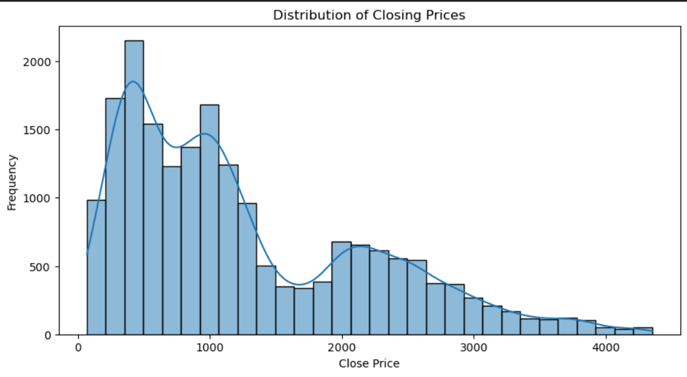
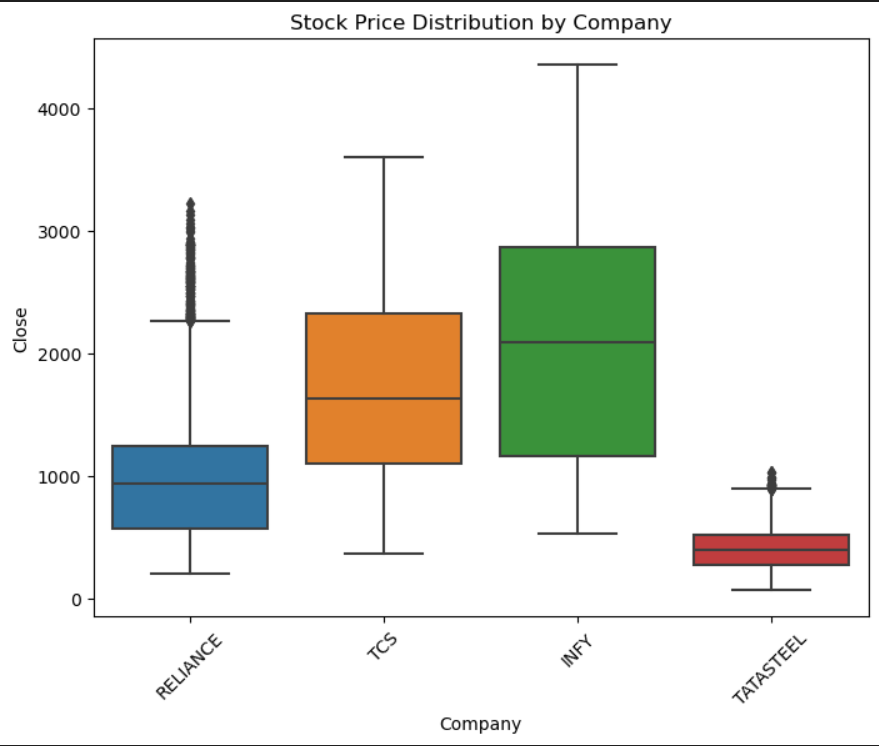
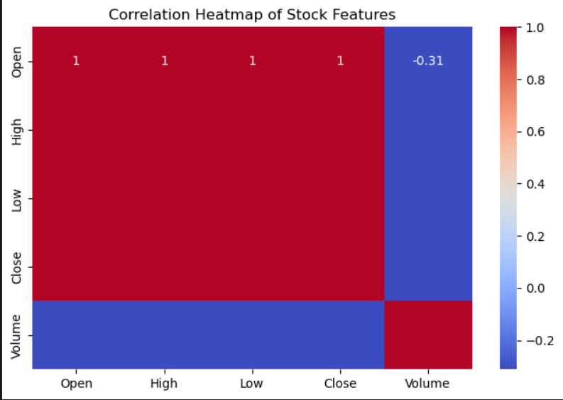
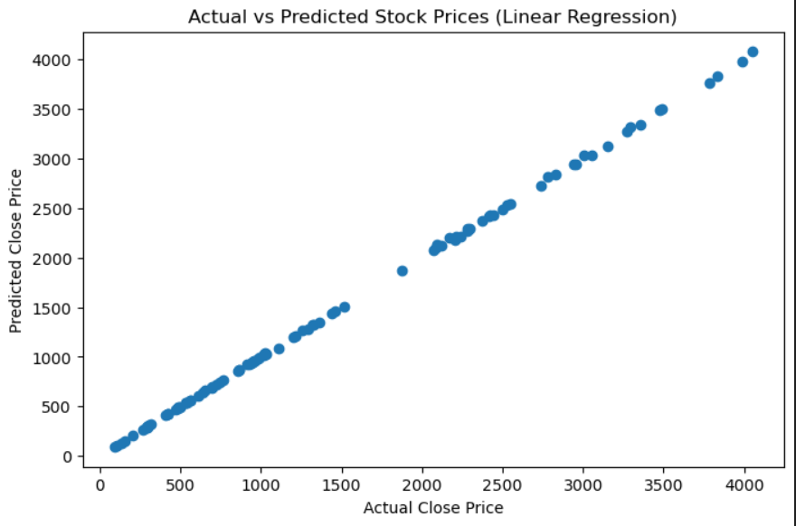
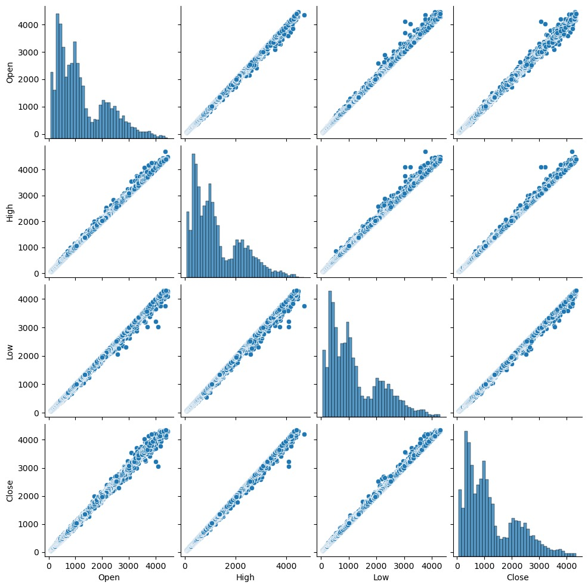

# Stock Market Trend Analysis & Price Prediction (NSE: 2000–2021)

A comprehensive data analysis and predictive modeling project on **21 years of NSE stock market data**, focusing on trend analysis, volatility, statistical testing, and price prediction using Linear Regression.

The study analyzes four major NSE-listed companies:
**Reliance Industries, TCS, Infosys, and Tata Steel**.

---

## Objective
The objective of this project is to apply **data preprocessing, exploratory data analysis (EDA), statistical analysis, and predictive modeling** on real-world financial data to:

- Understand long-term stock price trends
- Analyze volatility and correlations
- Compare company-wise behavior using statistical tests
- Predict closing prices using regression techniques

---

## Dataset
- **Dataset:** Nifty 50 Stock Market Data (2000–2021) (https://www.kaggle.com/datasets/rohanrao/nifty50-stock-market-data)
- **Source:** Kaggle – Rohan Rao  
- **Time Period:** 2000–2021
- **Records:** ~20,057
- **Companies Analyzed:** Reliance, TCS, Infosys, Tata Steel
- **Features:**
  - Date
  - Open
  - High
  - Low
  - Close
  - Volume
  - Company

This dataset provides a 21-year overview of India’s stock market behavior, trends, and volatility.

---

## Tech Stack
- Python
- Pandas
- NumPy
- Matplotlib
- Seaborn
- Scikit-learn
- SciPy (ANOVA)
- Jupyter Notebook

---

## Project Workflow
1. Data Cleaning & Preprocessing  
2. Exploratory Data Analysis (EDA)  
3. Statistical Analysis (ANOVA)  
4. Feature Encoding & Scaling  
5. Predictive Modeling (Linear Regression)  
6. Model Evaluation & Insights  

---

## Data Cleaning & Preparation
- Missing values handled using **forward fill**
- Duplicate records removed
- Date column converted to `datetime` format
- Outliers detected using **Interquartile Range (IQR)**
- Company column label-encoded
- Features scaled for regression modeling

---

## Exploratory Data Analysis (EDA)

### 🔹 Univariate Analysis
- Price distributions showed **long-term upward trends**
- **Tata Steel** exhibited the highest volatility
- **Infosys** showed relatively stable price movement

### 🔹 Multivariate Analysis
- Strong positive correlation among **Open, High, Low, and Close**
- Pairplots revealed distinct growth patterns across companies

### 🔹 Distribution & Skewness
- Price features were **moderately right-skewed**
- Skewness values ranged between **0.93 – 0.94**
- Indicates occasional high-price spikes, common in stock data

---

## Statistical Analysis (ANOVA)
A **one-way ANOVA test** was conducted to compare mean closing prices across companies.

- **Null Hypothesis (H₀):** Mean closing prices are equal
- **Alternative Hypothesis (H₁):** At least one company differs
- **Result:** p-value < 0.05

 **Conclusion:**  
The null hypothesis was rejected, confirming **statistically significant differences** in stock behavior among companies.

---

## Predictive Modeling
- **Model Used:** Linear Regression
- **Input Features:** Open, High, Low, Volume
- **Target Variable:** Close Price

### Model Performance
- **R² Score:** 0.99
- **RMSE:** 12.55
- **MAE:** 6.75

The model demonstrated strong predictive ability, highlighting the linear relationship among stock price variables.

---

## Visualizations
- Closing price trends (2000–2021)
- Correlation heatmap
- Moving average analysis
- Volume vs price movement

 *All visualizations were created using Matplotlib and Seaborn.*

### Closing Price Distribution

### Company-wise Volatility Comparison

### Correlation Heatmap

### Actual vs Predicted Prices (Linear Regression)

### Feature Relationship Analysis

---

## Key Insights
- Price-related features are highly correlated
- Reliance and TCS show consistent long-term growth
- Infosys exhibits stable and low-volatility behavior
- Tata Steel is highly volatile due to commodity market cycles
- Statistical testing confirms distinct company-wise behavior

---

## Future Improvements
- Time-series forecasting using **ARIMA, LSTM, Prophet**
- Incorporating macroeconomic indicators (GDP, inflation)
- Sentiment analysis using news and social media data

---
